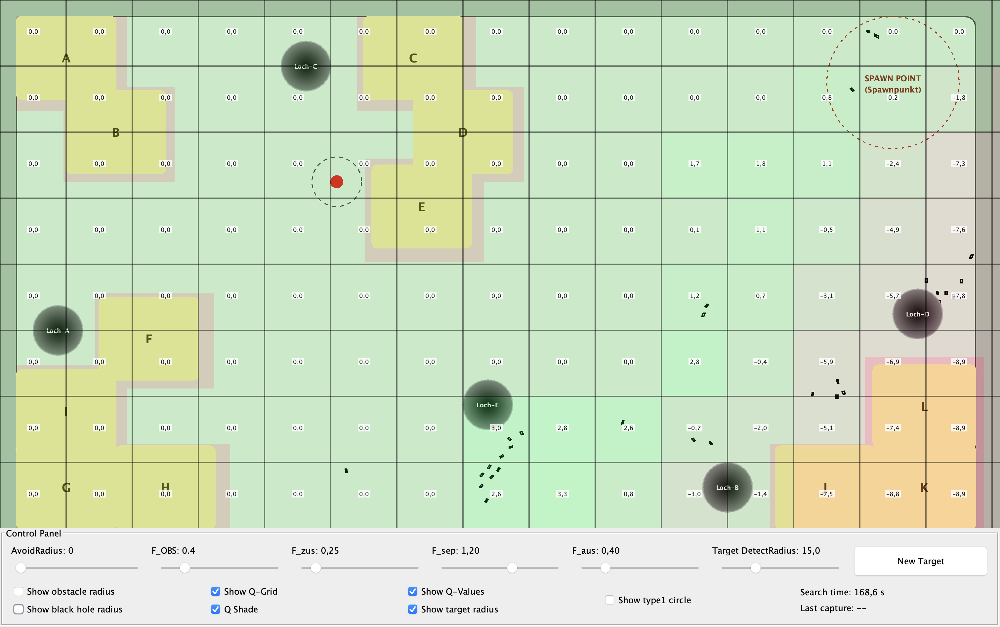

# SwarmSimulation

SwarmSimulation is a Java Swing simulation of a vehicle swarm navigating a 2D arena with rectangular obstacles, black holes, and moving targets. The current version combines classic boids-style swarm behavior with a shared Q-learning table so the swarm can learn from experience over time.



## What It Does

- Vehicles move through the arena using separation, alignment, cohesion, obstacle avoidance, and Q-learning guidance.
- Targets spawn inside the active world while avoiding obstacles and black holes.
- Vehicles can detect a target, switch into a consuming phase, and then disperse before the next target appears.
- The swarm shares one Q-table, so learning from one vehicle benefits the rest of the group.

## Main Behaviors

### Swarm Motion

- **Separation** keeps vehicles from crowding each other.
- **Alignment** nudges vehicles toward a local average heading.
- **Cohesion** pulls vehicles toward nearby flock members.
- **Obstacle avoidance** steers vehicles away from rectangular obstacles.
- **Q-learning steering** adds a learned correction force on top of the swarm forces.

### Target Hunting

- **Target spawning** places a new target in the arena while avoiding obstacles and black holes.
- **Target capture** starts when a vehicle enters the detection radius.
- **Consumption** holds the target active briefly after detection.
- **Dispersal** temporarily randomizes motion so the swarm does not clump after capture.
- **Target timing** tracks search duration and last capture time in the control panel.

### Black Holes and Obstacles

- **Black holes** are loaded from `src/main/resources/blackholes.txt` and drawn as circular hazards.
- **Obstacles** are loaded from `src/main/resources/obstacles.txt` and drawn as rounded rectangles.
- **Spawnability overlay** shows where targets can and cannot be placed.
- **Radius overlays** can show obstacle and black hole influence zones.

## Q-Learning

The simulation uses a shared Q-table to learn a better policy over time.

- The state space is discretized into grid cells.
- The action space is four directions: up, down, left, and right.
- Rewards currently include:
  - `+100` for target capture
  - `-100` for black hole collisions
  - `-10` for obstacle contact
  - `-1` for a normal step
- A small exploration bonus is also applied to less visited cells to improve coverage of the map.

## Visual Overlays

The canvas supports several debug and learning overlays:

- **Q-Grid** draws the discrete grid used by the Q-table.
- **Q Shade** adds a very light transparent heatmap based on the best Q-value in each cell.
- **Q-Values** prints the numeric best Q-value for each cell.
- **Obstacle radius** shows the avoidance radius around obstacles.
- **Black hole radius** shows the danger radius around black holes.
- **Target radius** shows the detection radius around the current target.
- **Spawn area** shows the initial spawn circle used for vehicle placement.
- **Type1 circle** shows the debug range circles for type-1 vehicles.

## Control Panel

The control panel is arranged as two clean rows:

- Row 1 contains the sliders and the `New Target` button.
- Row 2 contains the toggles, with the timer at the end.

### Controls Reference

| Control                      | Type    | Purpose                                                      |
| ---------------------------- | ------- | ------------------------------------------------------------ |
| `AvoidRadius`                | Slider  | Sets the base sensing distance used for obstacle avoidance.  |
| `ObsWeight`                  | Slider  | Changes how strongly obstacle avoidance influences movement. |
| `F_zus`                      | Slider  | Controls cohesion strength.                                  |
| `F_sep`                      | Slider  | Controls separation strength.                                |
| `F_aus`                      | Slider  | Controls alignment strength.                                 |
| `Target DetectRadius`        | Slider  | Sets the radius used to detect a target.                     |
| `New Target`                 | Button  | Spawns a new target immediately.                             |
| `Show obstacle radius`       | Toggle  | Shows or hides the obstacle influence circles.               |
| `Show black hole radius`     | Toggle  | Shows or hides the black hole influence circles.             |
| `Show Q-Grid`                | Toggle  | Shows or hides the Q-table grid overlay.                     |
| `Q Shade`                    | Toggle  | Shows or hides the lightweight Q-value heat tint.            |
| `Show Q-Values`              | Toggle  | Shows or hides the numeric best Q-value labels.              |
| `Show target radius`         | Toggle  | Shows or hides the target detection radius.                  |
| `Show type1 circle`          | Toggle  | Shows or hides the type-1 vehicle debug circles.             |
| `Search time / Last capture` | Display | Shows the live search time and the last capture time.        |

### Sliders

- **AvoidRadius** changes the base sensing distance used for obstacle avoidance.
- **ObsWeight** changes how strongly obstacle avoidance affects motion.
- **F_zus** controls cohesion strength.
- **F_sep** controls separation strength.
- **F_aus** controls alignment strength.
- **Target DetectRadius** changes how close a vehicle must be to count as a target capture.

### Toggles

- **Show obstacle radius** shows or hides the obstacle influence circles.
- **Show black hole radius** shows or hides the black hole influence circles.
- **Show Q-Grid** shows or hides the Q-table grid overlay.
- **Q Shade** shows or hides the lightweight Q-value heat tint.
- **Show Q-Values** shows or hides the numeric value labels in each cell.
- **Show target radius** shows or hides the target detection radius.
- **Show type1 circle** shows or hides the debug circles around type-1 vehicles.
- **Search time / Last capture** displays the current search time and the last capture time in the final control-panel cell.

## Project Structure

- `src/main/java/com/dgx/Simulation.java`: application entry point, UI, timers, and simulation loop.
- `src/main/java/com/dgx/Canvas.java`: draws vehicles, overlays, and debug visualizations.
- `src/main/java/com/dgx/Vehicle.java`: vehicle movement, steering, and swarm logic.
- `src/main/java/com/dgx/QEngine.java`: shared Q-table, action selection, and update logic.
- `src/main/java/com/dgx/Obstacle.java`: rectangular obstacle model.
- `src/main/java/com/dgx/BlackHole.java`: circular black hole model.
- `src/main/java/com/dgx/VectorCalculation.java`: 2D vector math helpers.

## Requirements

- Java 21
- Maven 3.9+

## Run

From the project root:

```bash
mvn clean package
java -cp target/classes com.dgx.Simulation
```

## Notes

- `pix` is the world-to-screen scaling factor used throughout the rendering code.
- The Q-table is visualized by collapsing the action axis into a single best-value per cell.
- The overlays are drawn on top of the arena so they stay visible above obstacles and black holes.
